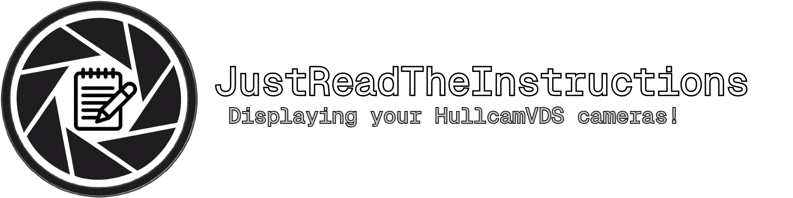
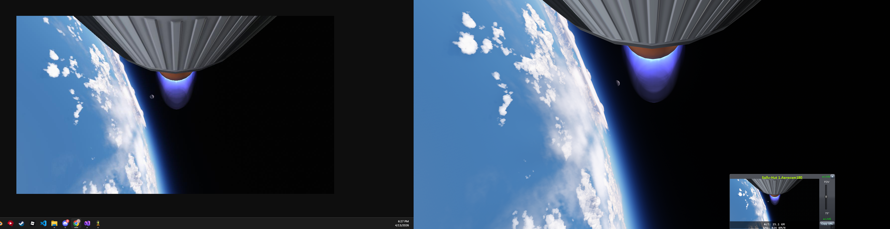

<p align="center">
  
</p>

<p align="center">
    <a href="https://ko-fi.com/relmymathieu"></a>
    <a href="https://github.com/RELMYMathieu/JustReadTheInstructions/releases/latest"></a>
    <a href="https://github.com/RELMYMathieu/JustReadTheInstructions/releases/latest"></a>
    <a href="https://spacedock.info/mod/4212/Just%20Read%20The%20Instructions"></a>
    <a href="https://opensource.org/licenses/MIT"></a>
</p>

<p align="center">
  A web-viewable Hullcam VDS camera feed mod for Kerbal Space Program.
</p>

<p align="center">
  Spiritual successor to <strong><a href="https://github.com/jrodrigv/OfCourseIStillLoveYou">OfCourseIStillLoveYou</a></strong>.
</p>

---

> [!NOTE]
> **JRTI is a tech demo as much as it is a mod - an experiment to see how far KSP can be pushed.**
>
> The mod is stable, but expect a few quirks. You may still encounter bugs or performance issues, but nothing that should hold you back from using the mod. If you do, please report them in the Issues tab with your log file attached. Prefixing the title with `Bug:` helps with triage.

---

>[!WARNING]
> **Mac OS**: Camera streaming works but uses a synchronous GPU readback fallback, as Metal does not support Unity's async readback API. This blocks the main thread briefly each captured frame and may cause minor stuttering at higher stream framerates.

## Overview

**Just Read The Instructions** (**JRTI**) is a mod for **Kerbal Space Program** that lets you view your **Hullcam VDS** camera feeds in a web browser, in the spirit of **OCISLY**.

## Project Status

> [!NOTE]
> **JRTI is now considered stable and feature-complete.** It works great, does what it set out to do, and I'm happy to call this a finished release rather than a perpetual work in progress.

After a long and genuinely enjoyable time building it, I'm stepping back from **frequent** major updates. The mod is in a good place, and the ideas I have left are either too big or fall outside its core purpose, and I'd rather leave it polished and whole than keep piling on for the sake of it.

It is **not** abandoned, though. I'll still come back for:

* **Major feature updates** which may still come out but at a much slower pace and depend a lot on how busy life gets
* **Great community suggestions** that fit the vision and that most players would benefit from
* **Quality-of-life tweaks** I get reminded of along the way
* **Security fixes** and important patches (we never know what could happen!)

Realistically, expect minor patches and QoL roughly every few weeks *if* suggestions keep rolling in, and otherwise I'll drop by now and then as the mood strikes, just less often when there's no feedback to ponder on. University starts for me in a few months as of this README commit, so my time will be a lot more limited too.

For anything **major**, pull requests are always welcome and I'm very open-minded, as long as a change fits the mod's vision, I'd love to see it.
I will **gladly** read any issues or PRs that may come up at any time.

Thank you to everyone who has downloaded the mod, gave feedback, or contributed... This has been a wonderful thing to build.
o7 and have fun :D

## Requirements

* **Kerbal Space Program** `1.12.x`
* **[HullcamVDS-Continued](https://github.com/linuxgurugamer/HullcamVDSContinued)** (latest version)

## Features

* View **Hullcam VDS** camera feeds in a web browser
* Externalize in-game camera views outside the main game window
* Record camera feeds from the web UI (locally on the KSP host, or Save-As on remote clients)
* Grab the raw MJPEG feed URL for OBS or other external tools
* Adjust brightness, contrast, gamma, and FOV per camera from the web viewer - applied server-side so all viewers on the local network see the same image
* Name cameras and assign a stable numeric ID from the part's right-click menu in the editor - kept in the craft file, so the stream URL stays the same across relaunches

## Camera Naming & IDs

Right-click a camera part in the VAB / SPH to open the **JRTI** group, where you can **Set Name** and **Set ID**. Both are saved in the craft file - no external config needed.

The ID is what appears in the camera's stream URL (`http://localhost:<port>/camera/<id>/stream`), so giving a camera a fixed ID lets you point OBS (or any tool) at the same URL every time you fly that craft.

A few details worth knowing about how IDs resolve at runtime:

* **Leave the ID blank (or 0) to auto-assign** the lowest free number, starting at `1`.
* **IDs are unique among cameras loaded at the same time.** They key the live stream endpoints, so two active cameras can never share one number.
* **Collisions are resolved automatically.** If two cameras would claim the same ID simultaneously - for example two separate craft both set to ID `1` while within physics range - the first one to load keeps it and the others are bumped to the next free number. Their feeds still work; only the numeric ID shifts.
* **IDs are scoped to a flight session.** They are freed when a craft is recovered or unloaded, and reset when you re-enter the flight scene, so relaunching a single craft reliably restores its chosen IDs.

## Screenshot



## Installation

**Via CKAN:** Search for `JustReadTheInstructions` in [CKAN](https://github.com/KSP-CKAN/CKAN) and install it from there.

**Via SpaceDock:** Download from the [SpaceDock page](https://spacedock.info/mod/4212/Just%20Read%20The%20Instructions) and follow the manual install steps below.

**Via GitHub:** Download the latest release ZIP from the [Releases page](https://github.com/RELMYMathieu/JustReadTheInstructions/releases), extract it, and move the `JustReadTheInstructions` folder into your KSP `GameData` folder.

Your final install should look like this:

```text
Kerbal Space Program/
└── GameData/
    └── JustReadTheInstructions/
```

## Customization

The **Loss of Signal** image shown in the web UI when a camera feed is unavailable can be customized with any PNG of your choice (recommended: `1920×1080`).

Add this file:

```text
GameData/JustReadTheInstructions/Web/images/customlos.png
```

If `customlos.png` is not present, JRTI automatically falls back to the built-in:

```text
GameData/JustReadTheInstructions/Web/images/los.png
```

> [!CAUTION]
> Editing files in the `Web` folder is not supported and may break the mod's functionality.

## Known Issues

A few known issues are tracked but not yet fixed:

* **Firefox recording output is unreliable.** The recorded file may be corrupt or unplayable. Use Chrome or Edge for recording until this is resolved.
* **Stale zero-byte buffer files** are sometimes left in the recordings folder after a session ends. They are safe to delete manually.
* **macOS is not properly supported.** A GPU async API used internally by this Unity version is unavailable on macOS, a legacy quirk inherited from KSP's Unity build. A fix is being investigated.
* **Performance degradation with Parallax.** Parallax integration is disabled by default. Enabling it in the Settings menu may cause significant frame-rate drops.

If you hit something not listed here, please open an issue with your log file attached. Prefixing the title with `Bug:` helps with triage.

## For Developers

### Prerequisites

* Visual Studio 2022 (Windows), or the .NET SDK with your editor of choice
* Kerbal Space Program `1.12.x`

HullcamVDS is declared as a dependency in the project and will be installed automatically via CKAN when you restore packages. If you already have HullcamVDS in your KSP `GameData`, it will be picked up from there without CKAN.

### Setup

Create a `JustReadTheInstructions.csproj.user` file next to the `.csproj` and point it at your KSP install:

**Windows:**

```xml
<Project>
  <PropertyGroup>
    <KSPBT_GameRoot>C:\Your\KSP\Install</KSPBT_GameRoot>
  </PropertyGroup>
</Project>
```

**Linux / macOS (native KSP):**

```xml
<Project>
  <PropertyGroup>
    <KSPBT_GameRoot>/home/you/KSP</KSPBT_GameRoot>
  </PropertyGroup>
</Project>
```

> `*.csproj.user` is gitignored and will never be committed.

> [!NOTE]
> **Running KSP through Proton on Linux?** KSPBuildTools expects a `KSP_Data` folder but the Windows/Proton build ships `KSP_x64_Data` instead. Create a symlink to fix this:
> ```bash
> ln -s "/path/to/Kerbal Space Program/KSP_x64_Data" "/path/to/Kerbal Space Program/KSP_Data"
> ```
> Replace `/path/to/Kerbal Space Program` with your actual Steam install path, e.g. `/home/you/.local/share/Steam/steamapps/common/Kerbal Space Program`.

### Building

```bash
dotnet build -c Release
```

The compiled DLL is written directly to `GameData/JustReadTheInstructions/Plugins/`.

> Using `Debug` instead of `Release` will also copy a bunch of Unity and system DLLs into that folder - they're harmless since KSP ignores them, but Release keeps it clean.

To install, symlink or copy `GameData/JustReadTheInstructions/` into your KSP `GameData/`.

## License

This project is licensed under the MIT License.
